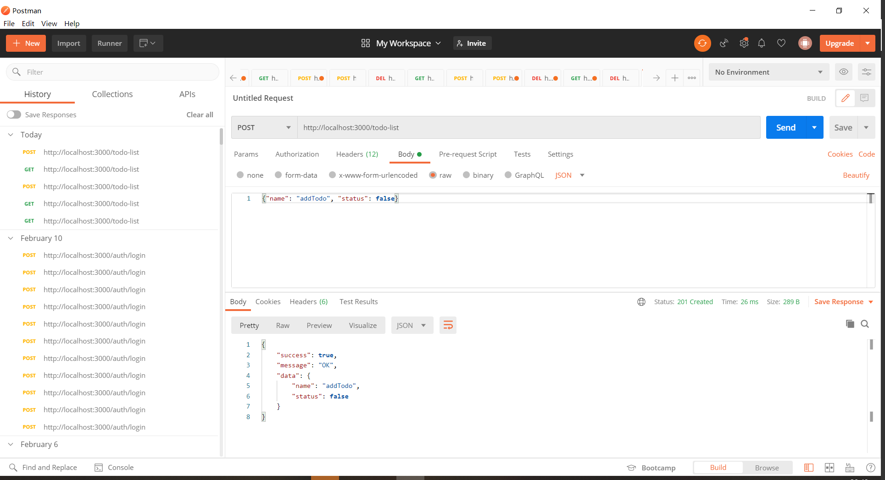
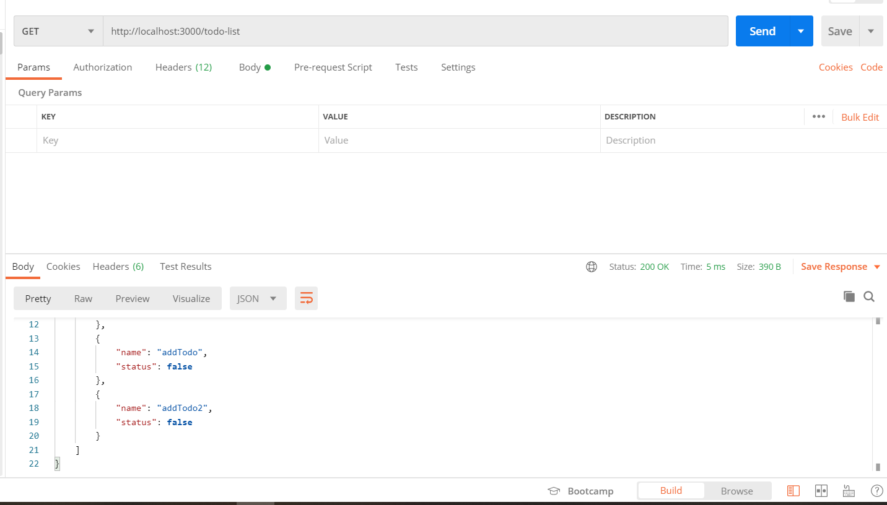
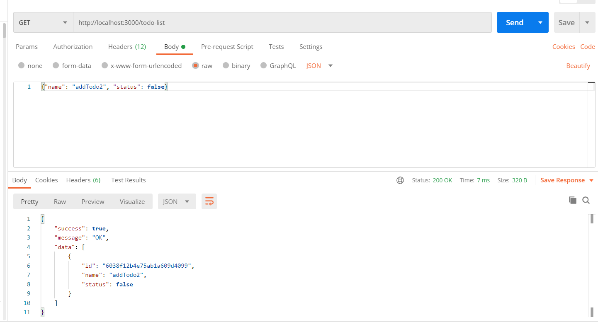
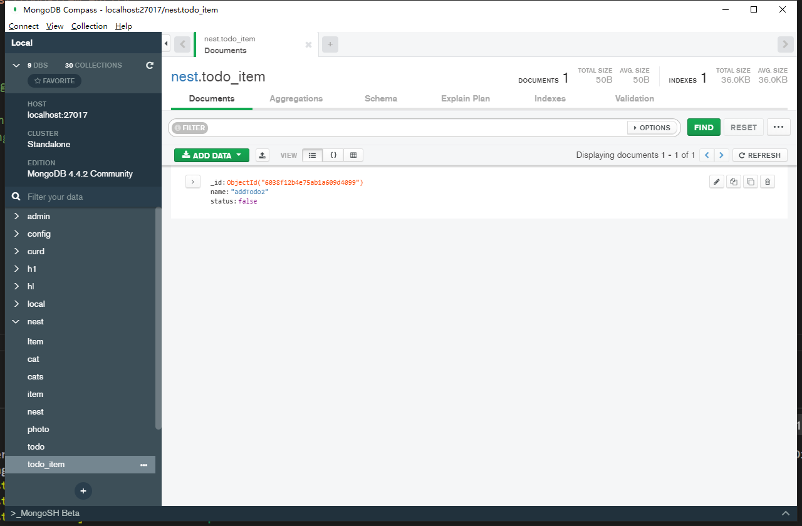
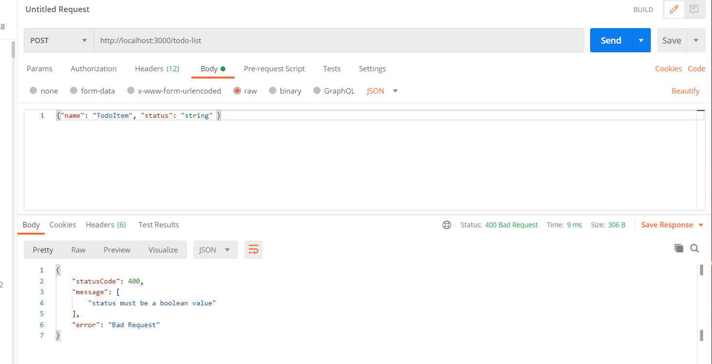

# CRUD？有手就行

## 开发中的问题

### 1.报错 Delete `␍`

解决方案 vscode 设置->搜索CRLF ->默认行尾改为\n

### 2.typeorm + mongodb 储存数据时报错

```
[ExceptionsHandler] Cannot read property 'createValueMap' of undefined +2836ms
```

在实体的定义中使用了 @PrimaryGeneratedColumn()装饰器 

改为  @ObjectIdColumn()  

```typescript
import { Entity, Column, ObjectIdColumn } from 'typeorm';

@Entity()

export class Todo {
  @ObjectIdColumn()

  id: number;

 

  @Column()

  name: string;

 

  @Column()

  target: string;

}

 
```


## 阅读前

CRUD(Create/Read/Update/Delete) ，本文是写给前端的入门服务端应用的教程。利用nest.js + typeorm + 数据库 构建服务端应用，完成对数据库的 (创建/读取/更新/删除)。


本文将涉及到

- TypeScript
- es6+
- node


1. async函数

   async函数是使用`async`关键字声明的函数。  `async`和`await`关键字让我们可以用一种更简洁的方式写出基于[`Promise`](https://developer.mozilla.org/zh-CN/docs/Web/JavaScript/Reference/Global_Objects/Promise)的异步行为，而无需刻意地链式调用`promise` 。返回值 ：一个[`Promise`](https://developer.mozilla.org/zh-CN/docs/Web/JavaScript/Reference/Global_Objects/Promise)，这个promise要么会通过一个由async函数返回的值被解决，要么会通过一个从async函数中抛出的（或其中没有被捕获到的）异常被拒绝。 

   ```javascript
   function resolveAfter2Seconds() {
     return new Promise(resolve => {
       setTimeout(() => {
         resolve('resolved');
       }, 2000);
     });
   }
   
   async function asyncCall() {
     console.log('calling');
     const result = await resolveAfter2Seconds();  //await表达式会暂停整个async函数的执行进程并出让其控制权交还给调用asyncCall的函数，只有当其等待的基于promise的异步操作被兑现或被拒绝之后才会恢复进程。
     console.log(result);
     // expected output: "resolved"
   }
   
   asyncCall();
   console.log('test');
   
   //  >>calling
   //  >>test
   //  >> resolved
   ```

2. Typescript 类型注解

   TypeScript里的类型注解是一种轻量级的为函数或变量添加约束的方式。 在这个例子里，我们希望`greeter`函数接收一个字符串参数。 然后尝试把`greeter`的调用改成传入一个数组：

   ```
   function greeter(person: string) {
       return "Hello, " + person;
   }
   
   let user = [0, 1, 2];
   
   document.body.innerHTML = greeter(user);
   ```

   重新编译，你会看到产生了一个错误。

   ```
   error TS2345: Argument of type 'number[]' is not assignable to parameter of type 'string'.
   ```

   类似地，尝试删除`greeter`调用的所有参数。 TypeScript会告诉你使用了非期望个数的参数调用了这个函数。 在这两种情况中，TypeScript提供了静态的代码分析，它可以分析代码结构和提供的类型注解。

   

3. 对象的类型接口

   TypeScript的核心原则之一是对值所具有的*结构*进行类型检查。 它有时被称做“鸭式辨型法”或“结构性子类型化”。 在TypeScript里，接口的作用就是为这些类型命名和为你的代码或第三方代码定义契约。 

   ```typescript
   interface Person {
       name: string;
       age: number;
   }
   
   let tom: Person = {
       name: 'Tom',
       age: 25
   };
   //我们定义了一个接口 Person ,它含有两个属性 name(字符串), age(数字类型)， 然后定义了一个变量tom,他的类型是 Person。当tom缺少Person类型的值或者多了不属于Person 类型的值时，将会报错
   ```

   

4. 输入验证类型（也叫DTO）

   因为后面将会用到管道来验证值的类型

    首先(如果您使用 `TypeScript`)，我们需要确定 `DTO`(数据传输对象)模式。`DTO`是一个对象，它定义了如何通过网络发送数据。我们可以通过使用 `TypeScript`接口或简单的类来完成。推荐使用类。为什么?类是`JavaScript` `ES6`标准的一部分，因此它们在编译后的 `JavaScript`中保留为实际实体。另一方面，由于 `TypeScript`接口在转换过程中被删除，所以 `Nest`不能在运行时引用它们。这一点很重要，因为诸如**管道**之类的特性在运行时能够访问变量的元类型时提供更多的可能性。 

   ```typescript
   export class CreateCatDto {
     readonly name: string;
     readonly age: number;
     readonly breed: string;
   }
   ```

   

5. 安装好 **node**

6. 安装好一个数据库（本文用的是**mongodb**） 在nest中使用typeORM 还支持`mySql` `PostgreSQL` 、`Oracle`、`Microsoft SQL Server`、`SQLite`。

7. 安装数据库可视化工具 我用的是 **MongoDB  Compass**，我们用它查询数据库中的数据。

8. 安装**Postman** 后面我们将利用这个软件来发起请求

## 上手

### 使用Nest CLI 建立新项目

```
$ npm i -g @nestjs/cli
$ nest new project-name
```

### 运行应用程序

```
$ npm run start --watch
```

或者运行npm脚本 start:dev

此命令在src 目录中的main.ts 文件中定义的端口上启动HTTP服务器。在应用程序运行时，打开浏览器并访问http://localhost:3000/。如果页面显示了Hello world 信息 说明运行成功。

### 创建module

 模块是具有 `@Module()` 装饰器的类。 `@Module()` 装饰器提供了元数据，Nest 用它来组织应用程序结构。 

 每个 Nest 应用程序至少有一个模块，即根模块。根模块是 Nest 开始安排应用程序树的地方。事实上，根模块可能是应用程序中唯一的模块，特别是当应用程序很小时，但是对于大型程序来说这是没有意义的。在大多数情况下，您将拥有多个模块，每个模块都有一组紧密相关的**功能**。 

使用CLI创建module

```
$ nest g module todoList 
```

将会在src目录上新建文件夹todo-list,并添加文件  todo-list.module.ts。TodoListModule模块自动导入到根模块 在 app.module.ts 文件中 发现@module()装饰器导入了TodoListModule模块。


### 创建controller

控制器用于负责处理传入请求和向客服端返回响应。

控制器的目的是接收应用的特定请求。**路由**机制控制哪个控制器接收哪些请求。通常，每个控制器有多个路由，不同的路由可以执行不同的操作。

为了创建一个基本的控制器，我们使用类和`装饰器`。装饰器将类与所需的元数据相关联，并使 `Nest` 能够创建路由映射（将请求绑定到相应的控制器）。

使用CLI创建controller

```
$ nest g controller todoList
```

在`todo-list.module`文件中 `TodoListController` 已经自动导入。


### 创建service

 Providers 是 `Nest` 的一个基本概念。许多基本的 `Nest` 类可能被视为 provider - `service`,` repository`, `factory`, `helper` 等等。 他们都可以通过 `constructor` **注入**依赖关系。 这意味着对象可以彼此创建各种关系，并且“连接”对象实例的功能在很大程度上可以委托给 `Nest`运行时系统。 Provider 只是一个用 `@Injectable()` 装饰器注释的类。 

使用CLI创建service

```
$ nest g service todoList
```

 在`todo-list.module`文件中 `TodoListService`已经自动导入。


### 处理请求和参数

接下来我们来熟悉一下刚才创建的几个文件。

在controller 中处理客户端请求

在 刚刚生成的文件`todo-list.controller`中编写代码

```ts
import {
  Body,
  Controller,
  Get,
  Post,
  Delete,
  Query,
  Param,
} from '@nestjs/common';

@Controller('todo-list') // 将会匹配 http://localhost:3000/todo-list的请求
export class TodoListController {
  //当发送get请求到 http://localhost:3000/todo-list 时将会调用 findById() 函数
  @Get()

  //这个使用了@Query()装饰器来获取id 值，这个将匹配到你在链接上的参数 比如 Get http://localhost:3000/todo-list?name=test
  //在浏览器里面直接输入链接，或者利用Postman测试示例
  //将会获取到值 {name: "test"},写入到值queryAata， 如果你装饰器@Query('参数') 里面有参数，
  //就会获取({name: "test"})["参数"] 写入到 queryAata 如果参数是'name' ({"name": "test"})["name"] = test
  async findByName(@Query('name') queryAata: string) {
    return {
      success: true,
      message: 'OK',
      data: queryAata,
    };
  }

  //当发送Post 请求到 http://localhost:3000/todo-list 时将会调用 addTodoItem() 函数
  @Post()

  //上面的@Query()装饰器 传输值的类型只能是字符串,当我们需要传输一个对象，或者布尔值等 需要用 @Body()装饰器.我们用Postman 来测试这个示例
  //Post http://localhost:3000/todo-list 然后设置参数 在Body参数里面选择 raw JSON  输入{"status": false}
  //因为我写入了参数 'status' 所以 bodyData的值是 false ,如果我们没有写入参数 将会是{status: false}
  async addTodoItem(@Body('status') bodyData: boolean) {
    console.log(bodyData);

    return {
      success: true,
      message: 'OK',
      data: bodyData,
    };
  }

  //当发送Delete 请求到 http://localhost:3000/todo-list/123 时将会调用 DeleteToDoItem() 函数
  @Delete(':id')
  //@Param() 获取到{ id: '123' },写入参数'id', paramData的值会是({id: '123'})['id']=123,
  async DeleteToDoItem(@Param() paramData: string) {
    return { success: true, message: 'OK', data: paramData };
  }
}

```


### 简单的TodoListService

创建一个简单的TodoListService`todo-list/todo-list.service.ts`


```typescript
import { Injectable } from '@nestjs/common';
import { Item } from './interfaces/item.interface';
@Injectable()
export class TodoListService {
  private todoList: Item[] = [];
  addTodoItem(item: Item) {
    return this.todoList.push(item);
  }
  findAll() {
    return this.todoList;
  }
}

```

在上面我们导入了一个接口，现在我们来创建它。

在todo-list 下新建一个文件夹 interfaces ，在新建文件夹下新建文件item.interface.ts

`todo-list/interfaces/item.interface.ts`

这个文件里我们定义了一个Item接口

```typescript
export interface Item {
  name: string;
  status: boolean;
}

```

现在`TodoListService`里面有两个方法 一个是**addTodoItem**，将接受一个Item接口形状的数据，并把它保存到this.todoList 中，这里我们还没有用到数据库，在后面我们将用`typeORM`来储存数据到数据库中。

还有一个是**findAll**方法,将返回this.todoList。 


`todo-list.controller.ts` 

在 `TodoListController`中使用`TodoListService`

```typescript
import { TodoListService } from './todo-list.service';
```

```typescript
export class TodoListController{
      constructor(private todoListService: TodoListService) {}
}
```

```typescript
const data = await this.todoListService.findAll();
```

```typescript
const data = await this.todoListService.addTodoItem(bodyData);
```

完整代码

```typescript
import { Body, Controller, Get, Post, Delete, Param } from '@nestjs/common';
import { TodoListService } from './todo-list.service';
import { AddTodoItemDto } from './dto/add-todo-item.dto';
@Controller('todo-list') // 将会匹配 http://localhost:3000/todo-list的请求
export class TodoListController {
  constructor(private todoListService: TodoListService) {}
  //@Get()
  //当发送get请求到 http://localhost:3000/todo-list 时将会调用 findAll() 函数
  @Get()
  async findAll() {
    const data = await this.todoListService.findAll();
    return {
      success: true,
      message: 'OK',
      data,
    };
  }

  //@Post()
  //当发送Post 请求到 http://localhost:3000/todo-list 时将会调用 addTodo() 函数
  @Post()
  //上面的@Query()装饰器 传输值的类型只能是字符串,当我们需要传输一个对象，或者布尔值等 需要用 @Body()装饰器.我们用Postman 来测试这个示例
  //Post http://localhost:3000/todo-list 然后设置参数 在Body参数里面选择 raw JSON  输入{"status": false}
  async addTodoItem(@Body() bodyData: AddTodoItemDto) {
    await this.todoListService.addTodoItem(bodyData);
    return {
      success: true,
      message: 'OK',
      data: bodyData,
    };
  }

  //@Delete
  //当发送delete 请求到 http://localhost:3000/todo-list 时将会调用 DeleteToDoItem() 函数
  @Delete(':id')
  async DeleteToDoItem(@Param('id') id: string) {
    return { success: true, message: 'OK', data: id };
  }
}

```

因为后面将会用到管道来验证值的类型，接口将会在转换中删除，所以我们要新建一个类来定义传入值的形状。

以下是官方文档的解释。

 首先(如果您使用 `TypeScript`)，我们需要确定 `DTO`(数据传输对象)模式。`DTO`是一个对象，它定义了如何通过网络发送数据。我们可以通过使用 `TypeScript`接口或简单的类来完成。令人惊讶的是，我们在这里推荐使用类。为什么?类是`JavaScript` `ES6`标准的一部分，因此它们在编译后的 `JavaScript`中保留为实际实体。另一方面，由于 `TypeScript`接口在转换过程中被删除，所以 `Nest`不能在运行时引用它们。这一点很重要，因为诸如**管道**之类的特性在运行时能够访问变量的元类型时提供更多的可能性。 

```typescript
export class CreateCatDto {
  readonly name: string;
  readonly age: number;
  readonly breed: string;
}
```


我们在`todo-list`文件夹下，新建一个文件夹 `dto`

然后在`dto`下新建文件`add-todo-item.dto.ts`

```typescript
export class AddTodoItemDto {
  readonly name: string;
  readonly status: boolean;
}

```

在新建一个文件来储存 数据改变时要传入值的形状 。后面将会用的上

`dto`文件夹下 新建文件 `update-todo-item.dto.ts`

```typescript
export class UpdateTodoItemDto {
  readonly id: string;
  readonly name: string;
  readonly status: boolean;
}

```

现在我们使用PostMan来测试下程序

`post请求` 

***




`get请求`




## TypeORM

接下来我们将数据储存进数据库中。

本例使用的是mongodb  你也可以使用其他数据库，在nest中TypeORM 还支持 `mySql`、 `PostgreSQL` 、`Oracle`、`Microsoft SQL Server`、`SQLite` ，只要安装好其他数据库的依赖，例如你如果要使用`mysql` 只要把下面的命令中的`mongodb` 换成`mysql`， 在AppModule配置好数据库的连接，其他后面部分都是一样的。

```
$ npm install --save @nestjs/typeorm typeorm mongodb
```

在AppModule 中导入 TypeOrmModule

```js
import { Module } from '@nestjs/common';
import { AppController } from './app.controller';
import { AppService } from './app.service';
import { TypeOrmModule } from '@nestjs/typeorm';
import { TodoListModule } from './todo-list/todo-list.module';
@Module({
  imports: [
    TodoListModule,
    TypeOrmModule.forRoot({
      type: 'mongodb', //我用的是mongodb ，可选其他TypeORM 支持的数据库，安装好依赖
      host: 'localhost',
      port: 27017, //数据库端口号,mongodb默认27017
      //username: 'root',    因为mongodb 的连接不用 账号密码， 所以我这边注释了，如果你的数据库要密码的话，要写上去。
      //password: 'root',
      database: 'nest', 
      entities: [],//这个是导入的实体 在后面我们创建实体后，要添加进这个数组里面。
      synchronize: true,
      logging: false,
    }),
  ],
  controllers: [AppController],
  providers: [AppService],
})
export class AppModule {}

```

### 存储库模式

TypeORM 支持存储库设计模式，因此每个实体都有自己的存储库。可以从数据库连接获得这些存储库。为了继续这个示例，我们需要至少一个实体。我们来定义todoItem实体。

官方文档推荐在他们的域中就近创建实体，即相应的模块文件中创建。所以把todoItem实体保存在todo-list目录下。

`/todo-list/todo-item.entity.ts`

```js
import { Entity, Column, ObjectIdColumn } from 'typeorm';
@Entity()
export class TodoItem {
  @ObjectIdColumn() //文档是用 @PrimaryGeneratedColumn()装饰器的,也是从typeorm 中导入，但是我的数据库是mongodb储存数据会报错，所以我改用了 @ObjectIdColumn()这个装饰器。
  id: number;

  @Column()
  name: string;

  @Column()
  status: boolean;
}

```

每个实体必须至少有一个主键列，设置id为主键列，使用@PrimaryGeneratedColumn()装饰器 主键列自动生成，假设你希望id列自己写入 使用@PrimaryColumn() 装饰器。


要开始使用 `TodoItem` 实体，我们需要在模块的`forRoot()`方法的选项中（除非你使用一个静态的全局路径）将它插入`entities`数组中来让 `TypeORM`知道它的存在。

`app.module.ts`

```typescript
import { Module } from '@nestjs/common';
import { AppController } from './app.controller';
import { AppService } from './app.service';
import { TypeOrmModule } from '@nestjs/typeorm';
import { TodoListModule } from './todo-list/todo-list.module';
import { TodoItem } from './todo-list/todo-item.entity';
@Module({
  imports: [
    TodoListModule,
    TypeOrmModule.forRoot({
      type: 'mongodb', //我用的是mongodb ，可选其他TypeORM 支持的数据库，安装好依赖
      host: 'localhost',
      port: 27017, //数据库端口号,mongodb默认27017
      //username: 'root',    因为mongodb 的连接不用 账号密码， 所以我这边注释了，如果你的数据库要密码的话，要写上去。
      //password: 'root',
      database: 'nest', //
      entities: [TodoItem],
      synchronize: true,
      logging: false,
    }),
  ],
  controllers: [AppController],
  providers: [AppService],
})
export class AppModule {}

```


`/todo-list/todo-list.module.ts`

```typescript
import { Module } from '@nestjs/common';
import { TodoListController } from './todo-list.controller';
import { TodoListService } from './todo-list.service';
import { TodoItem } from './todo-item.entity';
import { TypeOrmModule } from '@nestjs/typeorm';

@Module({
  imports: [TypeOrmModule.forFeature([TodoItem])],
  controllers: [TodoListController],
  providers: [TodoListService],
})
export class TodoListModule {}

```

`forFeature()` 方法定义在当前范围中注册了哪些存储库。注册后，我们就可以使用 `@InjectRepository()`装饰器将 `TodoItemRepository` 注入到 `TodoListService` 中:

`/todo-list/todo-list.service.ts`

```typescript
import { InjectRepository } from '@nestjs/typeorm';
import { Repository } from 'typeorm';

export class TodoListService {
  constructor(
    @InjectRepository(TodoItem)
    private todoRepository: Repository<TodoItem>,
  ) {}
}
```


```typescript
import { Injectable } from '@nestjs/common';
import { InjectRepository } from '@nestjs/typeorm';
import { Repository } from 'typeorm';
import { TodoItem } from './todo-item.entity';
import { Item } from './interfaces/item.interface';
@Injectable()
export class TodoListService {
  constructor(
    @InjectRepository(TodoItem)
    private todoRepository: Repository<TodoItem>,
  ) {}

  async findAll(): Promise<TodoItem[]> {
    return this.todoRepository.find();
  }
  async addTodoItem(item: Item): Promise<TodoItem> {
    return this.todoRepository.save(item);
  }
  async findByName(name: string): Promise<TodoItem[]> {
    return this.todoRepository.find({ name });
  }

  async remove(id: string): Promise<void> {
    await this.todoRepository.delete(id);
    // return await this.todoRepository.delete(id);
    return null;
  }
  async updateTodoItem(id: string, updateData: Item): Promise<void> {
    await this.todoRepository.update(id, updateData);
    return null;
  }
}

```


在`todo-list.controller`中编写代码

```typescript
import {
  Body,
  Controller,
  Get,
  Post,
  Delete,
  Query,
  Param,
  Put,
} from '@nestjs/common';
import { TodoListService } from './todo-list.service';
import { UpdateTodoItemDto } from './dto/update-todo-item.dto';
import { AddTodoItemDto } from './dto/add-todo-item.dto';
@Controller('todo-list') // 将会匹配 http://localhost:3000/todo-list的请求
export class TodoListController {
  constructor(private todoListService: TodoListService) {}

  @Get()
  async findAll() {
    const data = await this.todoListService.findAll();
    return {
      success: true,
      message: 'OK',
      data,
    };
  }
  @Get('/find')
  async findByName(@Query('name') name: string) {
    const data = await this.todoListService.findByName(name);
    return {
      success: true,
      message: 'OK',
      data,
    };
  }
  @Post()
  async addTodoItem(@Body() bodyData: AddTodoItemDto) {
    const data = await this.todoListService.addTodoItem(bodyData);
    return {
      success: true,
      message: 'OK',
      data,
    };
  }

  @Put()
  async updateTodoItem(@Body() changeData: UpdateTodoItemDto) {
    return this.todoListService.updateTodoItem(changeData.id, {
      name: changeData.name,
      status: changeData.status,
    });
  }
  @Delete(':id')
  async DeleteToDoItem(@Param('id') id: string) {
    const data = await this.todoListService.remove(id);
    return {
      success: true,
      message: 'OK',
      data,
    };
  }
}

```


`post请求添加一个数据`




使用`mongodb compass` 查看数据库中的数据




使用`Get请求获取数据库中的数据`


`Put请求更新数据 `  需要 传入id,name,status,三个值。

`Delete 请求删除数据`

## 使用管道

现在直接发起请求并不会验证传输的值，会直接进行操作，我们使用管道来解决这个问题。

`Nest` 自带六个开箱即用的管道，即

- `ValidatioValinPipe`
- `ParseIntPipe`
- `ParseBoolPipe`
- `ParseArrayPipe`
- `ParseUUIDPipe`
- `DefaultValuePipe`

他们从 `@nestjs/common` 包中导出。

在这个示例中我们将用 `ValidatioValinPipe` 管道来验证传输值


### 类验证器

Nest 与 [class-validator](https://github.com/pleerock/class-validator) 配合得很好。这个优秀的库允许您使用基于装饰器的验证。装饰器的功能非常强大，尤其是与 Nest 的 Pipe 功能相结合使用时，因为我们可以通过访问 `metatype` 信息做很多事情，在开始之前需要安装一些依赖。

```
$ npm i --save class-validator class-transformer
```

安装完成后，我们就可以向 `AddTodoItemDto` 类添加一些装饰器。

> add-todo-item.dto.ts

```typescript
import { IsString, IsBoolean } from 'class-validator';
export class AddTodoItemDto {
  @IsString()
  readonly name: string;
  @IsBoolean()
  readonly status: boolean;
}

```

update-todo-item.dto.ts

```typescript
import { IsString, IsBoolean } from 'class-validator';
export class UpdateTodoItemDto {
  @IsString()
  readonly id: string;
  @IsString()
  readonly name: string;
  @IsBoolean()
  readonly status: boolean;
}

```

接下来在`todo-list.controller `中应用 管道`ValidatioValinPipe` 

从 `@nestjs/common` 导入 nest 自带的管道`ValidatioValinPipe` ；

然后绑定管道（可以绑在 controller 或是其方法上），我们使用 `@UsePipes()` 装饰器 ,也是从`@nestjs/common`中导入

```typescript
  @Post()
  @UsePipes(ValidationPipe)
  async addTodoItem(@Body() item: CreateItemDTO) {
    return {
      success: true,
      message: 'OK',
      data: this.todoService.createTodo(item),
    };
  }
```


更好的方法是， 将`ValidationPipe`设置为一个**全局作用域**的管道，用于整个应用程序中的每个路由处理器。  

`src/main.ts`

```typescript
import { ValidationPipe } from '@nestjs/common';
import { NestFactory } from '@nestjs/core';
import { AppModule } from './app.module';

async function bootstrap() {
  const app = await NestFactory.create(AppModule);
  app.useGlobalPipes(new ValidationPipe());
  await app.listen(3000);
}
bootstrap();

```


## Swgger

[OpenAPI](https://swagger.io/specification/)(Swagger)规范是一种用于描述 `RESTful API` 的强大定义格式。 `Nest` 提供了一个专用[模块](https://github.com/nestjs/swagger)来使用它。

### [安装](https://docs.nestjs.cn/7/recipes?id=安装)

首先，您必须安装所需的包：

```bash
$ npm install --save @nestjs/swagger swagger-ui-express
```

### [引导（Bootstrap）](https://docs.nestjs.cn/7/recipes?id=引导（bootstrap）)

安装过程完成后，打开引导文件（主要是 `main.ts` ）并使用 `SwaggerModule` 类初始化 Swagger：

```typescript
import { ValidationPipe } from '@nestjs/common';
import { NestFactory } from '@nestjs/core';
import { AppModule } from './app.module';
import { SwaggerModule, DocumentBuilder } from '@nestjs/swagger';
async function bootstrap() {
  const app = await NestFactory.create(AppModule);
  app.useGlobalPipes(new ValidationPipe());

  const options = new DocumentBuilder()
    .setDescription('The todoList API description')
    .setVersion('1.0')
    .build();
  const document = SwaggerModule.createDocument(app, options);
  SwaggerModule.setup('api', app, document);
  await app.listen(3000);
}
bootstrap();

```

`DocumentBuilder` 有助于构建符合 OpenAPI 规范的基础文档。它提供了几种允许设置诸如标题，描述，版本等属性的方法。为了创建一个完整的文档（使用已定义的 HTTP 路由），我们使用 `SwaggerModule` 类的 `createDocument()` 方法。 此方法接收两个参数，即应用程序实例和 Swagger 选项对象。

一旦创建完文档，我们就可以调用 `setup()` 方法。 它接收：

1. Swagger UI 的挂载路径
2. 应用程序实例
3. 上面已经实例化的文档对象

现在，您可以运行以下命令来启动 `HTTP` 服务器：

```bash
$ npm run start
```

应用程序运行时，打开浏览器并导航到 `http://localhost:3000/api` 。 你应该可以看到 Swagger UI




